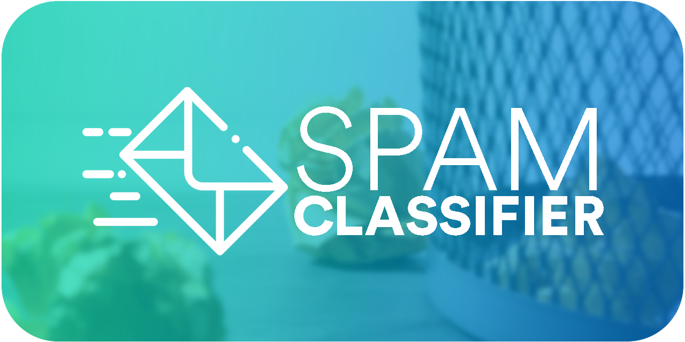

[](https://repl.it/github/Kyle-L/Spam-Classifier)

# Table of Contents <!-- omit in toc -->
- [Overview](#overview)
- [Local Setup](#local-setup)
- [The Data Sets](#the-data-sets)
- [Remote Setup](#remote-setup)
- [License](#license)

# Overview
As a simple assignment for my [Introduction to Artificial Intelligence course (CSE 486)](https://www.miamioh.edu/cec/academics/departments/cse/academics/course-descriptions/cse-486-586/index.html) at Miami University, we were tasked with a simple spam classifier with Bayes' theorem.

# Local Setup

If you would like to setup the project on your local machine, you can use the following instructions!

1. Download the repo.

```shell
$ git clone git@github.com:Kyle-L/Spam-Classifier.git
```

2. Install Pipenv using pip, install pip if you haven't already.

```shell
$ pip install pipenv
```

3. Setup a virtual environment with Pipenv.

```shell
$ python -m venv env
```

4. (on Windows) Start the virtual environment

```shell
$ ./env/Scripts/activate
```

4. (on Unix / Linux / MAC OS) Start the virtual environment

```shell
$ source env/bin/activate
```

5. Install the requirements

```shell
$ pip install -r classifier/requirements.txt
```

1. Run the classifier!

```shell
$ python classifier compare data/training_set_small.csv data/test_set.csv
```

Congrats! You are setup!

# The Data Sets
The expected input is a tab delimited file where the first column indicates whether or not a message is spam (1 = spam, 0 = ham) and the two column is the message. No header is expected.

An example input into the program is as follows...

```
0	Go until jurong point, crazy.. Available only in bugis n great world la e buffet... Cine there got amore wat...
0	Ok lar... Joking wif u oni...
1	Free entry in 2 a wkly comp to win FA Cup final tkts 21st May 2005. Text FA to 87121 to receive entry question(std txt rate)T&C's apply 08452810075over18's
0	U dun say so early hor... U c already then say...
```

Provided in the repo are three data sets. A [small training set](data/training_set_small.csv), a [large training set](data/training_set_large.csv), and a [small test set](data/test_set.csv).

# Remote Setup

If you would like to use the chess engine remotely, we can use the online IDE Repl.it!

Simply select the following badge or visit the following link: [https://repl.it/github/Kyle-L/Spam-Classifier](https://repl.it/github/Kyle-L/Spam-Classifier)

[](https://repl.it/github/Kyle-L/Spam-Classifier)

Once, it has opened, all you need do is select run!

# License

The source code is licensed under a [MIT License](https://github.com/Kyle-L/Spam-Classifier/LICENSE).

[](https://github.com/Kyle-L/Spam-Classifier/LICENSE.md)

